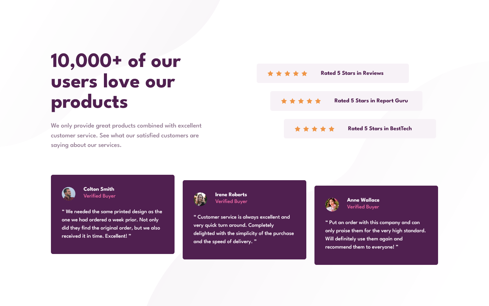
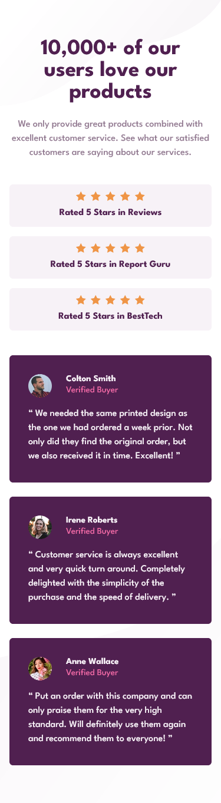

# Frontend Mentor - Social proof section solution

This is a solution to the [Social proof section challenge on Frontend Mentor](https://www.frontendmentor.io/challenges/social-proof-section-6e0qTv_bA). Frontend Mentor challenges help you improve your coding skills by building realistic projects. 

## Table of contents

- [Overview](#overview)
  - [The challenge](#the-challenge)
  - [Screenshot](#screenshot)
  - [Links](#links)
- [My process](#my-process)
  - [Built with](#built-with)
  - [What I learned](#what-i-learned)
- [Author](#author)

**Note: Delete this note and update the table of contents based on what sections you keep.**

## Overview

### The challenge

Users should be able to:

- View the optimal layout for the section depending on their device's screen size

### Screenshot

#### Desktop

#### Mobile

### Links

- Solution URL: [https://github.com/Akiz-Ivanov/social-proof-section](https://github.com/Akiz-Ivanov/social-proof-section)
- Live Site URL: [https://akiz-ivanov.github.io/social-proof-section/](https://akiz-ivanov.github.io/social-proof-section/)

## My process

### Built with

- Grid
- Flexbox
- Mobile-first workflow
- Semantic HTML5 markup
- Tailwind CSS
- Vite
- React

### What I learned

In this project, I practiced precise positioning of background pattern images, especially with responsive layout techniques. I also tackled a layout challenge involving offset rating components and testimonial cards, refining my skills in handling alignment quirks and spacing with utility classes. 

## Author

- Frontend Mentor - [@Akiz97](https://www.frontendmentor.io/profile/Akiz97)